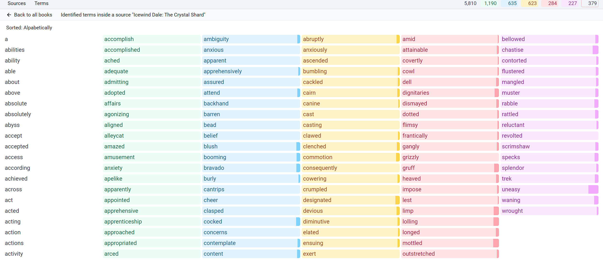

# Lexigrind

An application in the style of [LWT](https://learning-with-texts.sourceforge.io/) for grinding English vocabulary.

> #### ⚠️ Warning
>
> This app is in a _Proof of Concept_ stage. All the data is saved inside the browser,
> in IndexedDB. It is not very stable in terms of persistence (sometimes data is lost, it seems like it depends
> on browser updates), so if you use it, it is advised to export your _Sources_ and _Terms_
> after each session to be able to restore you data after a loss. A more robust approach would be
> to make it an Electron-based app, with a proper, proven database like SQLite or MongoDB,
> which I intend to do in the future.

### Why?

I like to do programming stuff, I like to learn languages, and I like to read books.
Here is where all three crisscross each other

### Features

- Words
  - Selecting a word copies it to clipboard
  - Marking words with levels from 0 to 5
    - "0-5" keys set level of the words (also "W" marks as "0")
    - "I" key sets the level to "ignored"
    - "U" key sets the level to "unidentified"
  - Adding personal notes to words
- Various stats of one's vocabulary
  - Source/Fragment stats
  - Calculated percentages of source/fragment
  - Calculated paragraph levels
- Press "Z" for zen mode

### Screenshots

#### Sources

#### Source Terms

#### Fragment View

